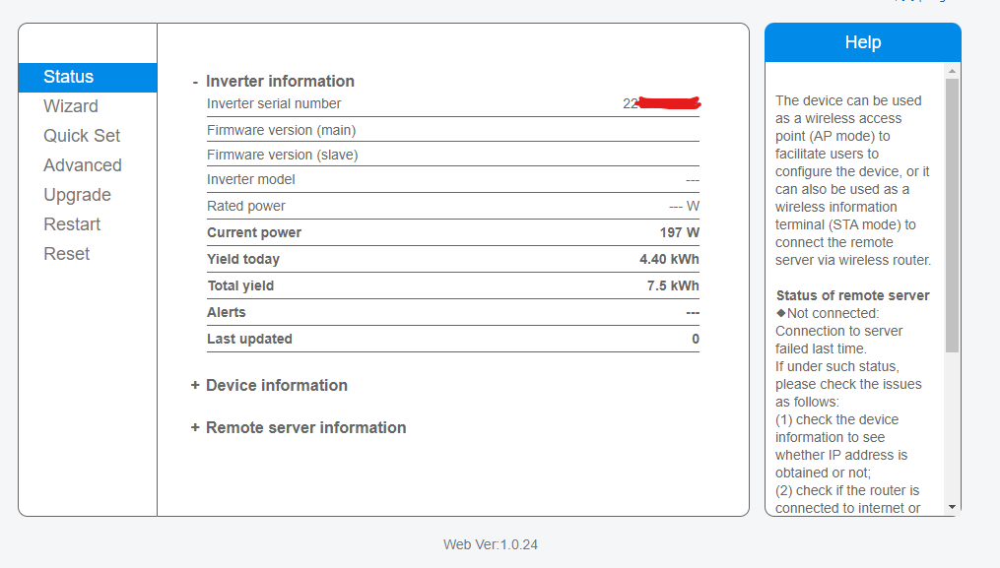

# Readme.md - deye2mqtt

Dieses Skript liest die aktuellen Leistungsdaten von einem Deye-Wechselrichter, die oft bei Balkonkraftwerken zum Einsatz kommen, aus und veröffentlicht sie über MQTT. Es nutzt dazu das Web-Frontend, das der Wechselrichter bereitstellt. Das Skript verwendet eine Konfigurationsdatei, um auf den Inverter und den MQTT-Broker zuzugreifen.

Es gibt viele andere Projekte, die die Daten aus der Cloud auslesen ODER direkt via Modbus-Protokoll mit dem Wechselrichter sprechen. Da ich diesen gerne cloudfrei betreiben möchte und alle Modbus-Varianten nicht funktionierten, ist dieses Projekt auf einer Idee von bonnerchen aus dem openhabforum.de entstanden.

Es ist so ausgelegt, dass es als Systemdienst ausgeführt wird und automatisch beim Starten des Systems gestartet wird. Das Skript läuft komplett Cloud-frei, die Cloud-Funktion des Wechselrichtes kann unterbunden werden. Dazu einfach für den Wechselrichter im Router den Internetzugang sperren.

## Kompatible Geräte
Es sind alle Geräte kompatibel, die dieses Webinterface zur Verfügung stellen:

Ich selbst betreibe das Skript an einem Deye-SUN600.

## Anforderungen
- Ein Deye-Wechselrichter
- curl
- Mosquitto-Client (mosquitto_pub)

## Hinweis zum cloudfreien Betrieb
Wenn der Internetzugang für den Wechselrichter gesperrt wird, kann dieser die erzeugte Tagesleistung nicht mehr korrekt übermitteln, da der Tageszähler offenbar nächtlich von der Cloud und nicht durch das Gerät selbst zurückgesetzt wird. Der Wert des insgesamt erzeugten Stroms wird weiterhin übermittelt, sodass sich die Tagesproduktion auch dadurch selbst berechnen lässt.

## Übermittelte Werte per MQTT
Das Skript übermittelt folgende Werte an den Broker:
- deye/LWT: Online/Offline (String). Gibt an, ob der Dienst läuft und der Wechselrichter erreichbar ist.
- deye/current_power: Zahl. Gibt in Watt die aktuelle Produktionsleistung an.
- deye/total_today: Zahl. Gibt die Produktionsleistung des aktuellen Tages in kWh an (bitte Hinweis zum cloudfreien Betrieb beachten) 
- deye/total_liftetime: Zahl. Gibt die gesamte Produktionsleistung in kWh an.

## Automatische Installation
1. Laden Sie die Datei deye2mqtt.deb herunter und installieren diese über `sudo dpkg -i deye2mqtt.deb`.
2. Fahre Sie im Abschnitt Konfiguration fort.

## Manuelle Installation
1. Laden Sie die neueste Version des Skripts von Github herunter.
2. Stellen Sie sicher, dass die erforderlichen Pakete installiert sind (siehe Anforderungen).
3. Kopieren Sie die `deye2mqtt` Datei nach `/usr/bin` und stellen Sie sicher, dass sie ausführbar ist (`sudo chmod +x /usr/bin/deye2mqtt`).
4. Kopieren Sie die `deye2mqtt.conf` Datei nach `/etc`.
5. Kopieren Sie die `deye2mqtt.service` nach `/etc/system/system`.
6. Laden Sie den daemon neu: `sudo systemctl daemon-reload`.
7. Systemdienst aktivieren: `sudo systemctl enable deye2mqtt`.

## Konfiguration
Die Konfiguration erfolgt über die Datei `/etc/deye2mqtt.conf`. Die Datei enthält die folgenden Einstellungen:
- `broker_address`: Die IP-Adresse oder der Hostname des MQTT-Brokers.
- `broker_port`: Der Port, auf dem der MQTT-Broker ausgeführt wird.
- `mqtt_topic`: Das Basis-Thema, unter dem die Daten veröffentlicht werden.
- `deye_ip`: Die IP-Adresse des Inverters.
- `deye_user`: Der Benutzername des Inverter-Logins.
- `deye_pass`: Das Passwort des Inverter-Logins.
- `interval`: Die Anzahl der Sekunden, die das Skript zwischen den Abfragen des Inverters pausieren soll.

## Deinstallation
Um das Skript und die Konfigurationsdatei zu entfernen, verwenden Sie den Befehl `sudo dpkg -r deye2mqtt`. Dies entfernt das Skript und die Konfigurationsdatei und stellt alle Systemdateien auf den Zustand vor der Installation des Pakets zurück (nur, wenn es automatisch installiert wurde).